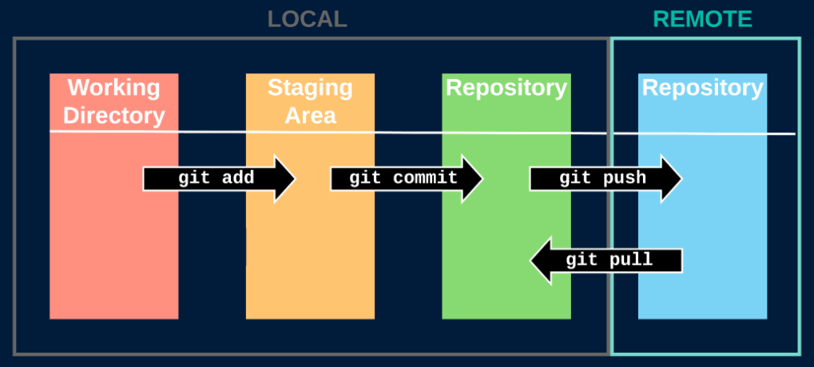
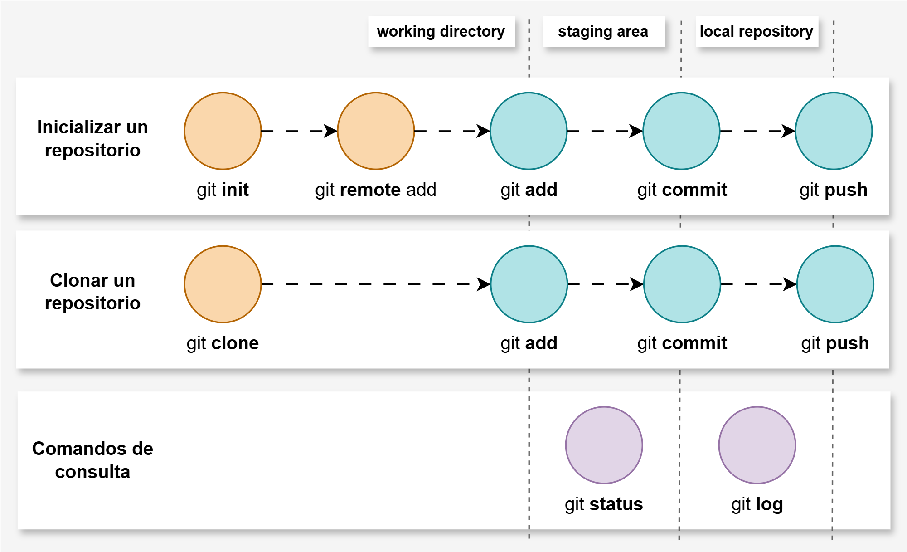

# GIT STAGES - INICIALIZAR Y CLONAR UN REPOSITORIO

[← Regresar a notas](../../README.md) <br>

---

## 1. Git stages
Representa los diferentes estados por los que pasan los archivos en Git.

| #   | Stage               | Descripción                                                           |
|-----|---------------------|-----------------------------------------------------------------------|
| 1   | `Working Directory` | Carpeta de trabajo donde están los archivos sin rastrear (untracked). |
| 2   | `Staging Area`      | Espacio en memoria RAM donde se guaradan los cambios (tracked).       |
| 3   | `Local Repository`  | Copia del repositorio de Git que reside en tu máquina local.          |                                             |
| 4   | `Remote Repository` | Versión centralizada del repositorio de Git.                          |                                             |



## 2. Inicializar y clonar un repositorio
- **Inicializar repositorio**: Crear un nuevo repositorio desde cero.
- **Clonar repositorio**: Copiar un repositorio existente.



## 3. Diccionario de comandos

> ### ▶️ Inicializar repositorio
> Este comando genera un subdirectorio `📁.git` que permite gestionar el historial de versiones del proyecto.
> ```shell script
> git init
> ```

---

> ### ▶️ Vincular al repositorio remoto
> Establece el repositorio remoto llamado `origin` y le asigna la URL.
> ```shell script
> git remote add origin <url-repository>
> ```

---

> ### ▶️ Clonar un repositorio
> - Podemos especificar el nombre de la carpeta 📁 en la que se descargará el repositorio.
> - Podemos utilizar `-b` para especificar la rama que queremos clonar.
> ```shell script
> git clone <url-repository>
> git clone <url-repository> <directory-name>
> git clone -b <branch-name> <url-repository> <directory-name>
> ```

---

> ### ▶️ Enviar cambios al <u>staging area</u>
> Podemos especificar cada archivo a la vez o podemos utilizar `.` para enviar todo. 
> ```shell script
> git add <file-name>
> git add .
> ```

---

> ### ▶️ Enviar cambios al <u>local repository</u>
> - Podemos utilizar `-am` para realizar en un solo paso `add` y `commit` <u>sobre los archivos que ya están trackeados</u>.
> - Si no ingresamos ningún argumento después de `commit`, nos solicitará ingresar un mensaje mediante el editor de texto VIM. 
>   - Edite el mensaje de commit presionando `ESC` seguido de `i`
>   - Guarde el commit presionando `ESC` seguido de `shift` + `z` + `z`
> ```shell script
> git commit -m "<my-message>"
> git commit -am "<my-message>"
> git commit
> ```

---

> ### ▶️ Enviar cambios al <u>remote repository</u>
> ```shell script
> git push -u origin <branch-name>
> ```

---

> ### ▶️ Descargar cambios del remote repository
> - El `git pull` funciona como un `git fetch` en combinación con `git merge`.
> - Puede utilizar `origin` para especificar la rama de la que quiere descargar los cambios.
> ```shell script
> git pull
> git pull origin <branch-name>
> ```

----